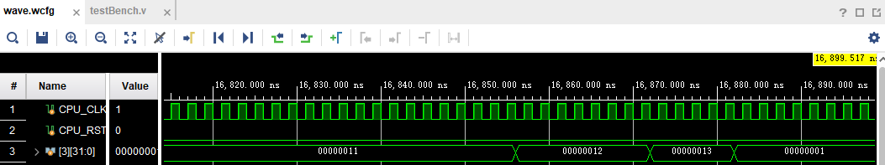
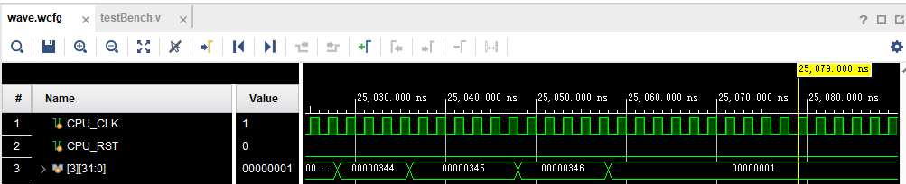

# Project 2

<p align="right">分数分配：平等分配</p>

<p align="right">3180105143 张家浚 3190105811 徐李可儿</p>

[toc]

## 实验目标

1.完善RV32流水线CPU中缺省模块的Verilog代码

2.使用适当的测试代码，验证CPU是否能成功运行RISC-V 32bit整形指令集

3.完善CPU相关模块逻辑，调整Harzard Unit等单元使流水线CPU顺利运行

## 实验环境和工具

实验环境：Windows 10操作系统

实验工具：Vivado 2021.2软件

根据testbench.v要求，目标设备是Nexys4开发板（使用vivado part xc7a100tcsg324-1模拟）

## 实验内容和过程

### CPU模块实现：Verilog源代码补充及分析

按模块图顺序


#### NPC_Generator模块

**设计思路**

NPC_Generator是用来生成Next PC值的模块，根据不同的跳转信号选择不同的新PC值。

考虑到JalD的赋值在ID段，BranchE/JalrE的赋值在EX段，所以当一个Branch/JALR指令紧接一个JAL指令时，信号的改变是同时的，需要控制if的顺序先检测BranchE/JalrE。

| 指令     | C0   | C1   | C2                | C3   | C4   | C5   |
| -------- | ---- | ---- | ----------------- | ---- | ---- | ---- |
| beq/jalr | IF   | ID   | EX(BranchE/JalrE) | MEM  | WB   |      |
| jal      |      | IF   | ID(JalD)          | EX   | MEM  | WB   |

**代码**

```verilog
begin
    if(BranchE)
        PC_In <= BranchTarget;
    else if(JalrE)
        PC_In <= JalrTarget;
    else if(JalD)
        PC_In <= JalTarget;
    else
        PC_In <= PCF+4;
end
```

#### IDSegReg模块

**设计思路**

IDSegReg是IF-ID段寄存器，嵌入了Instruction Memory，需要实现从Instruction Memory读取地址等数据。

由于输入的地址是字地址，需要后两位清零。

**代码**

```verilog
InstructionRam InstructionRamInst (
     .clk    ( clk        ),
     .addra  ( A[31:2]    ),
     .douta  ( RD_raw     ),
     .web    ( |WE2       ),
     .addrb  ( A2[31:2]   ),
     .dinb   ( WD2        ),
     .doutb  ( RD2        )
 );
```

#### ControlUnit模块

**设计思路**

对于每一种指令，查表，综合输入的Opcode、Fn3和Fn7来确定它的类型，

输出对应的控制信号，使用了大段的case选择，使用Parameter.v中定义的值增强了可读性。

控制信号决定的具体思路如下：

先Assign wire型变量

1.  JalD，JalrD：：只分别和JAL、JALR指令对应为1
2.  MemToRegD：只有Load指令为1
3.  LoadNpcD：只有JAL/JALR指令为1
4.  AluSrc2D：SLLI/SRLI/SRAI指令为01，R型和B型指令为00，其他指令均为10
5.  AluSrc1D：JALR/AUIPC/LUI指令为1，其他为0

再给Reg变量赋值

1.  ImmType：对应下表查取，根据Parameter.v赋值
2.  RegWriteD：Branch/Store 指令为0，Load指令已对应在Parameter.v中定义好了，其它为LW
3.  MemWriteD：SW 1111, SH 0011, SB 0001，其他为0
4.  RegReadD：R/S/B 型指令为11, I 型指令为10, U/J型指令为00
5.  BranchTypeD：分支指令已对应在Parameter.v中定义好了，其他指令为0
6.  AluContrlD：运算指令和LUI已在Parameter.v中定义好了，其他指令赋ADD


**代码**

```verilog
//assign wire
    assign JalD = (Op == 7'b1101111) ? 1'b1:1'b0;
    assign JalrD = (Op == 7'b1100111) ? 1'b1:1'b0;
    assign MemToRegD = (Op == 7'b0000011) ? 1'b1:1'b0;
    assign LoadNpcD = ((Op == 7'b1101111)||(Op == 7'b1100111)) ? 1'b1:1'b0;
    assign AluSrc2D = ((Op == 7'b0010011)&&(Fn3[1:0] == 2'b01)) ? (2'b01) : (((Op == 7'b0110011)||(Op == 7'b1100011)) ? 2'b00 : 2'b10);//00:ForwardData2 01:Rs2E 10:Imm
    assign AluSrc1D = (Op == 7'b0010111) ? 1'b1:1'b0;//0:ForwardData1 1:PC

//sequence:R-type,I-type,S-type,B-type,U-type,J-type
//output reg    output sequence:
//                    ImmType
//                    RegWriteD
//                    MemWriteD
//                    RegReadD
//                    BranchTypeD
//                    AluContrlD
    always@(*)
    begin
        case(Op)
            7'b0110011:    //R-TYPE 
                begin
                    ImmType <= `RTYPE;
                    RegWriteD <= `LW;
                    MemWriteD <= 4'b0000;
                    RegReadD <= 2'b11;
                    BranchTypeD <= `NOBRANCH;
//                  AluContrlD <= CASE BELOW;
                    case(Fn3)
                        3'b000:    //ADD or SUB
                            AluContrlD <= (Fn7 == 7'b0) ? (`ADD):(`SUB);
                        3'b001:    //SLL
                            AluContrlD <= `SLL;
                        3'b010:    //SLT
                            AluContrlD <= `SLT;
                        3'b011:    //SLTU
                            AluContrlD <= `SLTU;
                        3'b100:    //XOR
                            AluContrlD <= `XOR;
                        3'b101:    //SRL or SRA
                            AluContrlD <= (Fn7 == 7'b0) ? (`SRL):(`SRA);
                        3'b110:    //OR
                            AluContrlD <= `OR;
                        3'b111:    //AND
                            AluContrlD <= `AND;
                    endcase
                end
            7'b0010011:     //I-Type (ALU) 
                begin
                    ImmType <= `ITYPE;
                    RegWriteD <= `LW;
                    MemWriteD <= 4'b0000;
                    RegReadD <= 2'b10;
                    BranchTypeD <= `NOBRANCH;
//                  AluContrlD <= CASE BELOW;
                    case(Fn3)
                        3'b000:    //ADDI
                            AluContrlD <= `ADD;
                        3'b001:    //SLLI
                            AluContrlD <= `SLL;
                        3'b010:    //SLTI
                            AluContrlD <= `SLT;
                        3'b011:    //SLTUI
                            AluContrlD <= `SLTU;
                        3'b100:    //XORI
                            AluContrlD <= `XOR;
                        3'b101:    //SRLI or SRAI
                            AluContrlD <= (Fn7 == 7'b0) ? (`SRL):(`SRA);
                        3'b110:    //ORI
                            AluContrlD <= `OR;
                        3'b111:    //ANDI
                            AluContrlD <= `AND;
                    endcase
                end
            7'b0000011:    //I-Type (LOAD) 
                begin
                    ImmType <= `ITYPE;
//                  RegWriteD <= CASE BELOW;
                    MemWriteD <= 4'b0000;
                    RegReadD <= 2'b10;
                    BranchTypeD <= `NOBRANCH;
                    AluContrlD <= `ADD;
                    case(Fn3)
                        3'b000:    //LB
                            RegWriteD <= `LB;
                        3'b001:    //LH
                            RegWriteD <= `LH;
                        3'b010:    //LW
                            RegWriteD <= `LW;
                        3'b100: //LBU
                            RegWriteD <= `LBU;
                        3'b101: //LHU
                            RegWriteD <= `LHU;
                        default:
                            RegWriteD <= `NOREGWRITE;
                    endcase
                end
            7'b1100111: //I-Type (JALR) 
                begin
                    ImmType <= `ITYPE;
                    RegWriteD <= `LW;
                    MemWriteD <= 4'b0000;
                    RegReadD <= 2'b10;
                    BranchTypeD <= `NOBRANCH;
                    AluContrlD <= `ADD;
                end
            7'b0100011:    //S-Type
                begin
                    ImmType <= `STYPE; 
                    RegWriteD <= `NOREGWRITE;
//                  MemWriteD <= CASE BELOW;
                    RegReadD <= 2'b11;
                    BranchTypeD <= `NOBRANCH;
                    AluContrlD <= `ADD;
                    case(Fn3)
                        3'b000:    //SB
                            MemWriteD <= 4'b0001;
                        3'b001:    //SH
                            MemWriteD <= 4'b0011;
                        3'b010:    //SW
                            MemWriteD <= 4'b1111;
                    endcase
                end
            7'b1100011:    //B-Type
                begin
                    ImmType <= `BTYPE;
                    RegWriteD <= `NOREGWRITE;
                    MemWriteD <= 4'b0000;
                    RegReadD <= 2'b11;
//                  BranchTypeD <= `BEQ;
                    AluContrlD <= `ADD;
                    case(Fn3)
                        3'b000:    //BEQ
                            BranchTypeD <= `BEQ;
                        3'b001:    //BNE
                            BranchTypeD <= `BNE;
                        3'b100:    //BLT
                            BranchTypeD <= `BLT;
                        3'b101:    //BGE
                            BranchTypeD <= `BGE;
                        3'b110:    //BLTU
                            BranchTypeD <= `BLTU;
                        3'b111:    //BGEU
                            BranchTypeD <= `BGEU;
                        default:    //NOBRANCH
                            BranchTypeD <= `NOBRANCH;
                    endcase
                end
            7'b0110111:    //U-Type (LUI)
                begin
                    ImmType <= `UTYPE;
                    RegWriteD <= `LW;
                    MemWriteD <= 4'b0000;
                    RegReadD <= 2'b00;
                    BranchTypeD <= `NOBRANCH;
                    AluContrlD <= `LUI;
                end
            7'b0010111:    //U-Type (AUIPC)
                begin
                    ImmType <= `UTYPE;
                    RegWriteD <= `LW;
                    MemWriteD <= 4'b0000;
                    RegReadD <= 2'b00;
                    BranchTypeD <= `NOBRANCH;
                    AluContrlD <= `ADD;
                end
            7'b1101111:    //J-Type (JAL)
                begin
                    ImmType <= `JTYPE;
                    RegWriteD <= `LW;
                    MemWriteD <= 4'b0000;
                    RegReadD <= 2'b00;
                    BranchTypeD <= `NOBRANCH;
                    AluContrlD <= `ADD;
                end
            default:    //NOP
                begin
                    ImmType <= `ITYPE;
                    RegWriteD <= `NOREGWRITE;
                    MemWriteD <= 4'b0000;
                    RegReadD <= 2'b00;
                    BranchTypeD <= `NOBRANCH;
                    AluContrlD <= `ADD;                    
                end
        endcase
    end
```

#### ImmOperandUnit模块

**设计思路**

ImmOperandUnit利用正在被译码的指令的部分编码值，生成不同类型的32bit立即数，查指令表，对应填入。

**代码**

```verilog
        case(Type)
            `ITYPE: Out<={ {21{In[31]}}, In[30:20] };
            `STYPE: Out<={ {21{In[31]}}, In[30:25], In[11:7] };
            `BTYPE: Out<={ {20{In[31]}}, In[7], In[30:25], In[11:8], 1'b0 };
            `UTYPE: Out<={ In[31:12], 12'b0 };
            `JTYPE: Out<={ {12{In[31]}}, In[19:12], In[20], In[30:21], 1'b0 };
            default:Out<=32'hxxxxxxxx;
        endcase
```

#### BranchDecisionMaking模块

**设计思路**

根据不同的 BranchTypeE ，查表指定逻辑运算符，来对 Operand1, Operand2 进行逻辑运算，从而判断是否跳转 ，需要注意BGE，BGEU使用大于等于号，以及符号数的使用。

**代码**

```verilog
    case(BranchTypeE)
        `BEQ: BranchE<=(Operand1==Operand2) ? 1'b1:1'b0; 
        `BNE: BranchE<=(Operand1!=Operand2) ? 1'b1:1'b0; 
        `BLT: BranchE<=($signed(Operand1) < $signed(Operand2)) ? 1'b1:1'b0; 
        `BLTU: BranchE<=(Operand1<Operand2) ? 1'b1:1'b0; 
        `BGE: BranchE<=($signed(Operand1) >= $signed(Operand2)) ? 1'b1:1'b0; 
        `BGEU: BranchE<=(Operand1>=Operand2) ? 1'b1:1'b0; 
        default: BranchE<=1'b0; //NOBRANCH
    endcase
```

#### ALU模块

**设计思路**

ALU接受两个操作数，根据在Parameters.v中查找到AluContrl的类型的不同，进行不同的操作，将计算结果输出到AluOut，需要注意SRA和SLT用到了符号数需要指明类型。

**代码**

```verilog
    case(AluContrl)
        `SLL:        AluOut<=Operand1 << Operand2[4:0]; 
        `SRL:        AluOut<=Operand1 >> Operand2[4:0]; 
        `SRA:        AluOut<=$signed(Operand1) >>> Operand2[4:0]; 
        `ADD:        AluOut<=Operand1 + Operand2; 
        `SUB:        AluOut<=Operand1 - Operand2; 
        `XOR:        AluOut<=Operand1 ^ Operand2; 
        `OR:         AluOut<=Operand1 | Operand2; 
        `AND:        AluOut<=Operand1 & Operand2; 
        `SLT:        AluOut<=($signed(Operand1) < $signed(Operand2)) ? 32'b1:32'b0; 
        `SLTU:       AluOut<=(Operand1 < Operand2) ? 32'b1:32'b0; 
        `LUI:        AluOut<={Operand2[31:12], 12'b0}; 
        default:     AluOut<=32'hxxxxxxxx;                          
    endcase
```

#### WBSegReg模块

**设计思路**

WBSegReg是WB段寄存器，类似于IDSegReg.v中对Bram的调用和拓展，它嵌入了DataMemory，实现非字对齐Store，将字节地址AluOut[31:2]补零作为字地址addr存入，读取AluOut[1:0]储存指令类型存入WE，再将WD与WE对齐（WD<<(A[1:0]*8)）。

**代码**

```verilog
DataRam DataRamInst (
    .clk    (clk             ),
    .wea    (WE << A[1:0]    ),
    .addra  (A[31:2]         ),
    .dina   (WD << A[1:0]*8  ),
    .douta  ( RD_raw         ),
    .web    ( WE2            ),
    .addrb  ( A2[31:2]       ),
    .dinb   ( WD2            ),
    .doutb  ( RD2            )
);   
```

#### DataExt 模块

**设计思路**

根据Load指令类型，通过LoadedBytesSelect选择数据，实现非字对齐Load。

**代码**

```verilog
assign BIN = (IN >> (LoadedBytesSelect * 32'h8)) & 32'h000000ff;
assign HIN = (IN >> (LoadedBytesSelect * 32'h8)) & 32'h0000ffff;
always @(*)
begin
    case(RegWriteW)
         `LB: OUT<={{24{BIN[7]}},BIN[7:0]};
         `LH: OUT<={{16{HIN[15]}},HIN[15:0]};
         `LW: OUT<=IN;
         `LBU: OUT<={24'b0,BIN[7:0]};
         `LHU: OUT<={16'b0,HIN[15:0]};
         default:OUT = 32'hxxxxxxxx;
    endcase
end
```

#### HarzardUnit模块

**设计思路**

用来处理流水线冲突，通过插入气泡，数据前递以及冲刷流水段解决数据相关和控制相关，组合逻辑电路。

首先考虑处理Flush和Stall信号，并排列优先级，

1.  CpuRst是外部信号，用来初始化CPU，当CpuRst==1时CPU全局复位清零（所有段寄存器flush），优先度最高
2.  考虑跳转指令和分支指令，BranchE，JalrE信号在EX段产生，跳转实际发生时需要冲刷掉下一个指令的EX段和下下个指令的ID段，JalD信号在ID段产生，跳转实际发生时需要冲刷掉下一个指令的ID段，三个命令的优先级和NPC_Generator中所描述的一致，不再赘述
3.  再考虑需要Stall的情况，由于其他类型的Data Harzard都考虑用数据前递等方式处理，所以仅load指令之后紧接读取指令可能发生的WAR Hazard还需要插入气泡，此时首先MemToRegE为1，同时RdE和Rs1D、Rs2D任意一个发生冲突，可判断需要Stall前两段寄存器，FlushEx段
4.  考虑3.和2.中描述情况的先后顺序，如果2.中分支、跳转冲刷EX段，则不进行Stall，所以3.优先度更低
5.  处理默认情况，无冲突时，不Flush也不Stall，赋全0

接下来处理数据前递。

数据前递主要考虑的是有RegWrite和RegRead（是否正在进行寄存器读写），如果正在发生Hazard，通过判断寄存器号决定是否使用Forward中暂存的Data。

查询RV32Core.v中数据前递的处理方式，为 Forward信号赋值。

```verilog
assign ForwardData1 = Forward1E[1]?(AluOutM):( Forward1E[0]?RegWriteData:RegOut1E );
assign ForwardData2 = Forward2E[1]?(AluOutM):( Forward2E[0]?RegWriteData:RegOut2E );
```

**代码**

```verilog
//Stall and Flush signals generate
always @ (*)
    if(CpuRst)
        {StallF,FlushF,StallD,FlushD,StallE,FlushE,StallM,FlushM,StallW,FlushW} <= 10'b0101010101;
    else if(BranchE | JalrE)
        {StallF,FlushF,StallD,FlushD,StallE,FlushE,StallM,FlushM,StallW,FlushW} <= 10'b0001010000;
    else if(JalD)
        {StallF,FlushF,StallD,FlushD,StallE,FlushE,StallM,FlushM,StallW,FlushW} <= 10'b0001000000;
    else if(MemToRegE & ((RdE==Rs1D)||(RdE==Rs2D)) )
        {StallF,FlushF,StallD,FlushD,StallE,FlushE,StallM,FlushM,StallW,FlushW} <= 10'b1010010000;
    else
        {StallF,FlushF,StallD,FlushD,StallE,FlushE,StallM,FlushM,StallW,FlushW} <= 10'b0000000000;
//Forward1
always@(*)begin
    if( (RegWriteM!=3'b0) && (RegReadE[1]!=0) && (RdM==Rs1E) &&(RdM!=5'b0) )
        Forward1E<=2'b10;//Forward AluOutM
    else if( (RegWriteW!=3'b0) && (RegReadE[1]!=0) && (RdW==Rs1E) &&(RdW!=5'b0) )
        Forward1E<=2'b01;//RegWriteData
    else
        Forward1E<=2'b00;//RegOut
end
//Forward2
always@(*)begin
    if( (RegWriteM!=3'b0) && (RegReadE[0]!=0) && (RdM==Rs2E) &&(RdM!=5'b0) )
        Forward2E<=2'b10;//Forward AluOutM
    else if( (RegWriteW!=3'b0) && (RegReadE[0]!=0) && (RdW==Rs2E) &&(RdW!=5'b0) )
        Forward2E<=2'b01;//RegWriteData
    else
        Forward2E<=2'b00;//RegOut
end
```

### 实验仿真结果

#### PART1

测试使用了

-   改编自https://github.com/riscv-software-src/riscv-tests/tree/master/isa/rv32ui中的SLLI、SRLI、SRAI、ADD、SUB、SLL、SLT、SLTU、XOR、SRL、SRA、OR、AND、ADDI、SLTI、SLTIU、XORI、ORI、ANDI、LUI、AUIPC21个指令的测试，使用自制的批处理文件在windows环境下进行预处理并使用mingw32-make和提供的makefile和其他相关toolchain生成的测试文件

将从Github上获取的.S文件和2_BRAMInputFileGenerator中提供的enconding.h、riscv_test.h、test_macros.h放在同一目录下，执行批处理文件，代码如下：

```powershell
md preprocess
for %%i in (*.S) do gcc -E %%i -o ./preprocess/%%i
pause
```

成功得到预处理后的文件之后，拷贝提供的makefile和相关依赖项(Utils文件夹)，在preprocess文件夹中使用mingw32-make进行make，得到相应的测试文件

参照网站和文件的说明，CPU开始执行后3号寄存器gp的值会从2一直累增，全部执行结束后gp变为1，即以gp寄存器的终值是1作为测试通过的标准，当gp终值不为1，则说明在对应的test中出现问题中断执行


以对add指令的测试为例，分析执行结果，参照.S中的说明，add.S包含了基本算术指令测试（test_2-test_16），测试了算数指令是否正常运作（包括普通加和、溢出、大数运算）；源-目标测试（test_17-test_19）（数据源寄存器和目标寄存器一致的情况）；旁路设计测试（test_20-test_38）（测试能否正常进行数据前递）。

测试普遍采用了ra和sp作为源寄存器，t5作为目标寄存器，储存待测指令的结果值，t4用来比较，储存待测指令的参考值。

具体的一般做法是先用li或lui指令将值加载到源寄存器ra、sp和储存参考值的寄存器t4，测试指令并将结果输入到目标寄存器t5，将测试计数器gp的值+1，再将结果与参考值用bne比较，失败则跳转到fail语句进入死循环，成功则不跳转，顺行执行下一个test，特殊地，执行源-目标测试时，目标寄存器是ra或sp自身，执行旁路测试时，通过在待测指令和数据相关的指令之间插入零至两条NOP指令来实现冲突，其他指令的测试中，还有测试0号寄存器是否只读且内容始终为0等。


在运行波形仿真后，可以看到在跳转到1之前，寄存器gp的值是26（十六进制），也就是38（十进制），说明37个测试都成功地执行了。

类似的方法，我们可以知道PART1中的21个指令均能正常运行。

#### PART2

测试使用了

-   改编自https://github.com/riscv-software-src/riscv-tests/tree/master/isa/rv32ui中的JALR、LB、LH、LW、LBU、LHU、SB、SH、SW、BEQ、BNE、BLT、BLTU、BGE、BGEU、JAL16个指令的测试，使用自制的批处理文件在windows环境下进行预处理并使用mingw32-make和提供的makefile和其他相关toolchain生成的测试文件

使用和PART1中相同的方法得到测试文件。

以对LB指令的测试为例，分析执行结果，参照.S中的说明，LB.S包含了基本Load测试（test_2-test_11），测试了算数指令是否正常运作（包括普通读、负偏移量、未对齐的读取）；旁路设计测试（test_12-test_17）（测试能否正常进行数据前递）；WAW Hazard测试（test_18-test_19）（测试是否能正确处理Hazard）。



在运行波形仿真后，可以看到在跳转到1之前，寄存器gp的值是13（十六进制），也就是19（十进制)，说明18个测试都成功地执行了。

类似的方法，我们可以知道PART2中的16个指令均能正常运行。

#### PART3

测试使用了提供的1testAll、2testAll、3testAll三组测试文件。

测试结果：如图，参照文档说明，可以看到这三组测试也同样以gp寄存器的终值是1作为测试通过的标准。




查阅三个testAll.S中的说明，三个test已全包含了下列37个指令：

-   1testAll: ADD(2-38)、ADDI(39-62)、AND(63-88)、ANDI(89-101)、AUIPC(102-103)、BEQ(104-123)、BGE(124-146)、BGEU(147-169)、BLT(170-189)、BLTU(190-209)、BNE(210-229)、(FENCE_I(230-231)被注释掉了)、JAL(jal_test_2、232)、JALR(jalr_test_2、233-236) 
-   2testAll:LB(237-254)、LBU(255-272)、LH(273-290)、LHU(291-308)、LUI(309-313)、LW(314-331)、OR(332-357)、ORI(358-370)、SB(371-392)、SH(393-414)、SLL(415-459)、SLLI(460-486)、SLT(487-523)
-   3testAll:SLTI(524-547)、SLTIU(548-572)、SLTU(573-610)、SRA(611-652)、SRAI(653-675)、SRL(676-717)、SRLI(718-741)、SUB(742-777)、SW(778-799)、XOR(800-825)、XORI(826-838)

由此，对CPU的检验成功进行，所有指令都能正常执行，寄存器值均符合预期。

## 实验总结

3180105143 张家浚

踩过的坑：

-   没有考虑到跳转顺序的控制，使得每个测试在第一个测试点之后就跳转到失败。
-   对Verilog中变量使用括号索引从左从右计数的习惯不适应，错误的将Forward1E[0]和Forward1E[1]意义弄反导致错误。

收获：对CPU结构、时序控制和verilog编写增加了熟悉程度。

用时：

-   10小时学习Verilog基础并补全需要补的模块（包含debug过程）（共同）
-   2小时学习并使用Vivado进行波形仿真
-   2小时生成测试文件，调整testbench.v并运行所有测试
-   4小时完成思考题（共同）

3190105811 徐李可儿

踩过的坑：

-   没有仔细检查testAll包含的测试，自己去官方github找了测试，算是进行了一点无意义劳动。

收获：对RiscV指令集和数据通路有了更深入的理解。

用时：

-   6小时Verilog模块补全（包含debug过程）（共同）
-   4小时完成思考题（共同）
-   1小时完成文档撰写

## 提出改进实验的意见

-   定义在文件中的变量长度和实际长度有冲突，参照vivado的警告可以找到这几个变量并进行修改。（MemtoReg, AluContrl）
-   指导文档中博客园链接失效，需更新指导内容。
-   阶段三中提供的testfile已实际包含了前两阶段的testfile，似乎没有必要将测试分成三段，如果仍然想保留三段式的结构，可以考虑重新组织三个testAll.S中的指令顺序，按指令类型而不是字母序分成三个testfile。

## 思考题

1. 为什么将 DataMemory 和 InstructionMemory 嵌入在段寄存器中?

    通过将DataMemory和InstructionMemory嵌入，IDSegReg和WBSegReg可以同步读取memory中的数据，而若不这样做的话，通过异步读取则需要两个clock上升沿，开销更大。

2. DataMemory 和 InstructionMemory 输入地址是字 (32bit) 地址,如何将访存地址转化为字地址输入进去?

    InstructionMemory输入是PCF，访存地址是字地址，无需转化。

    DataMemory的输入是AluOut,访存地址是字节地址，需要低两位赋零。

3. 如何实现 DataMemory 的非字对齐的 Load?

    在 DataExt 模块通过AluOutM输出的LoadedBytesSelect信号对输入的数据进行移位，再进一步通过&运算选择数据并提取。

4. 如何实现 DataMemory 的非字对齐的Store?

    仿照提取过程，执行反过程，即将字节地址AluOut[31:2]补零作为字地址addr存入，读取AluOut[1:0]储存指令类型存入WE，再将WD与WE对齐（WD<<(A[1:0]*8)）。

5. 为什么 RegFile 的时钟要取反?

    RegFile需要在同一个周期先读取旧值再写入新值。从同一寄存器读取的寄存器文件将在下一个上升沿才将其值同步到 ID/EX 流水线寄存器中，为确保将刚刚写入的值传递给 EX阶段，我们需要在在下降沿写入寄存器文件来完成。所以，我们需要将时钟取反。

6. NPC_Generator中对于不同跳转target的选择有没有优先级?

    有优先级。如果同时遇到JalD和BranchE/JalrE，说明Branch/JALR指令在原来的顺序语句中更靠前，所以，需要设置Branch和JALR指令优先级更高，才能正确跳转。

7. ALU模块中,默认wire变量是有符号数还是无符号数?

    无符号数。

8. AluSrc1E执行哪些指令时等于1’b1?

    AUIPC 指令。

9. AluSrc2E执行哪些指令时等于2‘b01?

    SLLI/SRLI/SRAI 指令。

10. 哪条指令执行过程中会使得LoadNpcD==1？

    JAL/JALR 指令。

11. DataExt模块中，LoadedBytesSelect的意义是什么？

    LoadedBytesSelect用于从读取的字数据指定所需要的数据（字节/半字）

12. Harzard模块中，有哪几类冲突需要插入气泡？

    一类。

    由于其他类型的Harzard都用数据前递等其他方式处理，所以仅load指令之后立即使用load数可能发生的WAR Hazard还需要插入气泡。

13. Harzard模块中采用默认不跳转的策略，遇到branch指令时，如何控制flush和stall信号？

    如果Branch指令判断成功，Control Unit在EX段生成BranchE信号，需要冲刷ID、EX，所以将StallD，StallE置0，FlushD，FlushE置1，如果Branch判断不跳转，不涉及Flush和Stall。

14. Harzard模块中，RegReadE信号有什么用？

    判断现在Pipeline中Ex段是否使用寄存器的值，结合寄存器写信号（RegWriteM、RegWriteW）以及寄存器号（RdM、RdW）判断是否发生RAW Hazard，控制forward处理。

15. 0号寄存器值始终为0，是否会对forward的处理产生影响？

    不会，因为0号寄存器为只读的寄存器，始终forward0，不存在向x0写入的情况，也就不经过Harzard模块，所以不会对forward处理产生影响。

    

    

