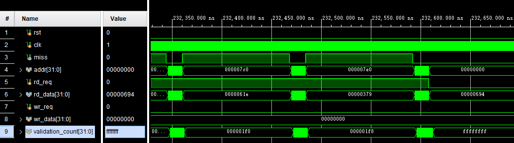
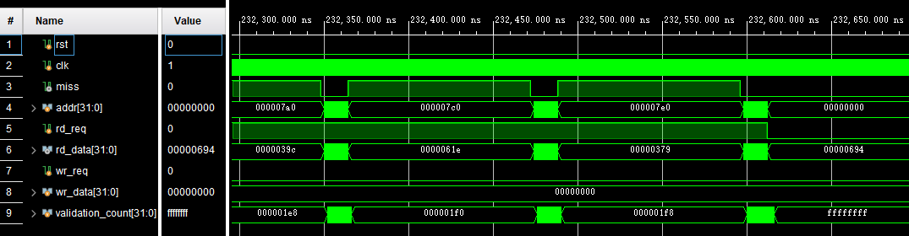
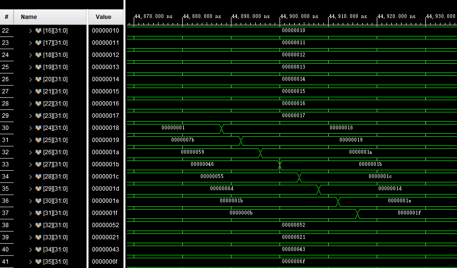
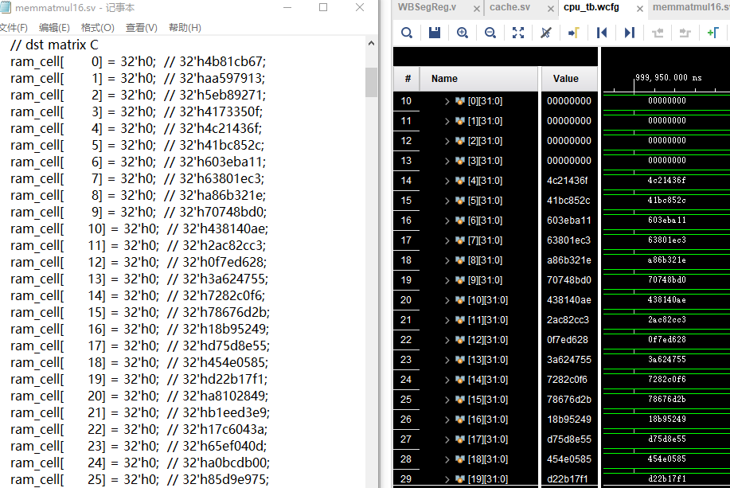

# Project3-Cache实验报告

<p align="right">分数分配：平等分配</p>

<p align="right">3180105143 张家浚 3190105811 徐李可儿</p>

[toc]

## 实验目标

​	首先按照阶段1、2的要求，理解实验材料所给的直接映射cache，并将其改为N路组相连的cache，并用其运行所给的cache读写测试。cache中需要实现cache line替换的两种策略：FIFO和LRU。

​	然后，需要基于实现的cache进行参数选择。改变cache size、组相连度N、FIFO和LRU策略的选择，并比较cache性能。最后，还需要理解写回法的优劣。

## 实验环境和工具

实验环境：Windows 10操作系统

实验工具：Vivado 2021.2软件

根据实验指导要求，目标设备是Nexys4开发板（使用vivado part xc7a100tcsg324-1模拟）

## 实验内容和过程

### 阶段一

#### 一、cache编写

​	首先，可以根据所给的cache.sv文件进行修改，实现组相联cache。根据文档，需要修改的有：

1）向cache_mem、cache_tags、valid、dirty这四个寄存器（数组）中加入一个维度[WAY_CNT]；

2）实现并行命中判断：在组内并行地判断每路line是否命中，具体实现为添加一个for循环，循环次数与组相联度N相等；

3）实现替换策略：不同于所给直接相连cache，组相联cache不是根据地址直接确定换出的cache line。根据要求，需要分别实现FIFO和LRU两种策略。

下面附上相应的cache.sv代码的改动点，解释主要以注释的形式给出。

1.对基本变量的改动

```verilog
//为下列寄存器加入路数这一维度
reg [31:0] cache_mem [SET_SIZE][WAY_CNT][LINE_SIZE]; 
// SET_SIZE*WAY_CNT个line，每个line有LINE_SIZE个word
reg [TAG_ADDR_LEN-1:0] cache_tags [SET_SIZE][WAY_CNT];            
// SET_SIZE*WAY_CNT个TAG
reg valid [SET_SIZE][WAY_CNT];            
// SET_SIZE*WAY_CNT个valid(有效位)
reg dirty [SET_SIZE][WAY_CNT];            
// SET_SIZE*WAY_CNT个dirty(脏位)

reg [WAY_CNT-1:0] hit_addr = 0; 
// 命中位置
reg [WAY_CNT-1:0] out_addr = 0; 
// 换出位置
```

2.定义FIFO、LRU两种策略

```verilog
enum {FIFO, LRU} strategy;

integer timestamp; 
//用于计算时间戳
reg [31:0] record [SET_SIZE][WAY_CNT]; 
//用于记录每个set每一路的timestamp
```

3.判断读写请求是否命中

```verilog
always @ (*) begin
    cache_hit = 1'b0;              // 判断输入的address是否在cache中命中
    for (integer i = 0; i<WAY_CNT;i++)
    begin
        if(valid[set_addr][i] && cache_tags[set_addr][i] == tag_addr)
        begin   // 如果 cache line有效，并且tag与输入地址中的tag相等，则命中
            cache_hit = 1'b1;
            hit_addr = i;
        end
    end
end
```

 改为N路组相连的cache后，需要对每个set内每一路进行遍历，判断cache line是否有效及tag是否相等。若相等，把cache_hit置为1，意为命中；同时用之前定义的hit_addr记录命中的路数。

4.cache状态机维护过程

```verilog
always @ (posedge clk or posedge rst) begin     // ?? cache ???
    if(rst) begin // rst signal is valid:all set 0
        cache_stat <= IDLE;
        timestamp <= 0;
        //strategy <= FIFO;	需要替换成FIFO策略时，取消注释这条语句，并注释掉下一句
        strategy <= LRU;
        for(integer i = 0; i < SET_SIZE; i++) begin
            for(integer j = 0; j < WAY_CNT;j++)begin
                dirty[i][j] = 1'b0;
                valid[i][j] = 1'b0;
                record[i][j] = 0;
            end
        end
        for(integer k = 0; k < LINE_SIZE; k++)
            mem_wr_line[k] <= 0;
        mem_wr_addr <= 0;
        {mem_rd_tag_addr, mem_rd_set_addr} <= 0;
        rd_data <= 0;
    end else begin
        timestamp++;//当初始化结束，时间戳随时钟周期增长
        case(cache_stat)
        IDLE:       begin
                        if(cache_hit) begin
                            if(rd_req) begin    // 如果cache命中，并且是读请求，
                                rd_data <= cache_mem[set_addr][hit_addr][line_addr];   								   					// 则直接从cache中取出要读的数据
                            end else if(wr_req) begin // 如果cache命中，并且是写请求，
                                cache_mem[set_addr][hit_addr][line_addr] <= wr_data;   								   					// 则直接向cache中写入数据
                                dirty[set_addr][hit_addr] <= 1'b1;                     								   					// 写数据的同时置脏位
                            end 
                            if(strategy == LRU)  LRU_record[set_addr][hit_addr] <= timestamp;//LRU在hit时也需要更新timestamp
                        end else begin
                            if(wr_req | rd_req) begin   
                                // 如果 cache 未命中，并且有读写请求，则需要进行换入换出
                                for (integer i = 0; i < WAY_CNT; i++) begin//计算换出的位置
                                    if (record[set_addr][i] < record[set_addr][out_addr]) begin
                                        out_addr = i;//选择最小的timestamp换出
                                    end
                                end
                                if(valid[set_addr][out_addr] & dirty[set_addr][out_addr]) begin
                                // 如果 要换入的cache line 本来有效，且脏，则需要先将它换出
                                    cache_stat  <= SWAP_OUT;
                                    mem_wr_addr <= {cache_tags[set_addr][out_addr], set_addr};
                                    mem_wr_line <= cache_mem[set_addr][out_addr];
                                end else begin                                   
                                    // 反之，不需要换出，直接换入
                                    cache_stat  <= SWAP_IN;
                                end
                                {mem_rd_tag_addr, mem_rd_set_addr} <= {tag_addr, set_addr};
                            end
                        end
                    end
        SWAP_OUT:   begin
                        if(mem_gnt) begin           
                            // 如果主存握手信号有效，说明换出成功，跳到下一状态
                            cache_stat <= SWAP_IN;
                        end
                    end
        SWAP_IN:    begin
                        if(mem_gnt) begin           
                            // 如果主存握手信号有效，说明换入成功，跳到下一状态
                            cache_stat <= SWAP_IN_OK;
                        end
                    end
        SWAP_IN_OK: begin           
        // 上一个周期换入成功，这周期将主存读出的line写入cache，并更新tag，置高valid，置低dirty，并向record中存入timestamp
                        for(integer i=0; i<LINE_SIZE; i++)  cache_mem[mem_rd_set_addr][out_addr][i] <= mem_rd_line[i];
                        cache_tags[mem_rd_set_addr][out_addr] <= mem_rd_tag_addr;
                        valid     [mem_rd_set_addr][out_addr] <= 1'b1;
                        dirty     [mem_rd_set_addr][out_addr] <= 1'b0;
                        record    [mem_rd_set_addr][out_addr] <= timestamp;
                        cache_stat <= IDLE;	// 回到就绪状态
                    end
        endcase
    end
end
```
​    首先处理和WAY_CNT和hit_addr有关的变量：包括复位初始化增加一层循环和读写位置的更改；再根据record变量处理out_addr：在复位初始化时，所有位的record均为0，当有数据写入时，将写入时的时间戳timestamp写入record，LRU和FIFO的区别在于record更新的条件，FIFO策略中换出路为record中存入的timestamp最小的路，也即最早进入cache的路，而LRU策略中在该路出现hit时，timestamp更新，确保最近使用的不会被换出，换出路为最早未被使用路。

#### 二、CPU代码修改

​    由于Proj2中所完成的CPU内嵌InstRam和DataRam，与Cache代码不兼容，因此，在Proj3中参照新提供的CPUSrcCode代码，对小组在Proj2中完成的的原始CPU代码进行了修改。根据对比，需要修改的有：

1）改写ID段寄存器接口，与阶段二生成的InstructionRam相连接；

2）改写WB段寄存器接口，与cache.sv连接，并新增hit_count、miss_count信号，便于阶段二要用到的比较；

3）改写HarzardUnit，实现DCachemiss时，全CPU的Stall；

4）改写底层RV32Core模块，实现模块改变后DCachemiss等信号传递；

1.ID段寄存器接口修改

```verilog
InstructionRam InstructionRam (
     .clk    ( clk        ),                        
     .addra   ( A[31:2]    ),                        
     .douta   ( RD_raw     )
 );
```

2.WB段寄存器接口修改以及新增信号

```verilog
always @ (posedge clk or posedge clear) begin
    if(clear) begin
        hit_count  <= 0;
        miss_count <= 0;
    end else begin
        if( cache_rd_wr & (last_addr!=A) ) begin
            if(DCacheMiss)
                miss_count <= miss_count+1;
            else
                hit_count  <= hit_count +1;
        end
    end
end


    cache #(
    .LINE_ADDR_LEN  ( 3             ),
    .SET_ADDR_LEN   ( 3             ),
    .TAG_ADDR_LEN   ( 5            ),
    .WAY_CNT        ( 4             )
) cache_test_instance (
    .clk            ( clk           ),
    .rst            ( clear         ),
    .miss           ( DCacheMiss    ),
    .addr           ( A       ),
    .rd_req         ( MemToRegM     ),
    .rd_data        ( RD_raw        ),
    .wr_req         ( |WE           ),
    .wr_data        ( WD            )
);
```

3.HarzardUnit修改

```verilog
    else if(DCacheMiss | ICacheMiss)
        {StallF,FlushF,StallD,FlushD,StallE,FlushE,StallM,FlushM,StallW,FlushW} <= 10'b1010101010;
```

4.底层RV32Core修改

仅涉及和以上三模块相关的接口增删以及DCacheMiss信号传递，并未有其他修改，故此处不再赘述

#### 三、testbench测试

​    使用generate_cache_tb.py生成新的读写规模为512的cache_tb.sv，建立Vivado工程，将cache.sv、main_mem.sv、mem.sv添加进Vivado工程的Design Sources，将cache_tb.sv添加进Vivado工程的Simulation Sources。添加后，点击Run Simulation->Run Behavioral Simulation 进行行为仿真，然后可以看到如下的波形：

首先，采用cache_tb.sv的默认参数，对两种策略进行测试

```verilog
cache #(
    .LINE_ADDR_LEN  ( 3             ),
    .SET_ADDR_LEN   ( 2             ),
    .TAG_ADDR_LEN   ( 12            ),
    .WAY_CNT        ( 3             )
)
```

FIFO



LRU



如图所示，完成所有读出数据的验证后，validation_count变为0xffffffff。参照文档说明，该数值即说明cache读写验证通过。

为排除主存大小影响，调整时固定主存大小（固定LINE_ADDR_LEN + SET_ADDR_LEN + TAG_ADDR_LEN之和，即根据LINE_ADDR_LEN和SET_ADDR_LEN的改变相应调整TAG_ADDR_LEN），分别改变参数进行多次验证，验证了如下组合：

(1)组数固定，改变组相连度

固定LINE_ADDR_LEN=3、SET_ADDR_LEN=2，分别令WAY_CNT = 2，4，8

(2)cache大小固定，改变组数和组相连度

固定LINE_ADDR_LEN=3、令SET_ADDR_LEN=3，WAY_CNT = 2

(3)cache大小固定，改变Line大小和组数

令LINE_ADDR_LEN=2、SET_ADDR_LEN=3，WAY_CNT = 3

验证均通过，由于结果图几乎一致，不再展示所有验证结果。

### 阶段二

#### 1.Quicksort仿真结果和综合结果

使用提供的asm2verilog.py和generate_mem_for_quicksort.py，分别以128和256为数组大小参数，生成实验所用的InstructionRam和mem，替换文件接入CPU进行快排和矩阵乘法测试，再多次更改Cache参数测试，并对比性能。由于图片过多，仅展示一组仿真结果。



由图可知，随着程序的运行，大部分mem中数据逐渐变得有序(由于Cache采取写回策略，最终有部分数据留在Cache，但未能写入mem)，成功运行了排序程序。以所提供CPUSrcCode中WBSegReg规定的默认参数为基础，对不同参数Cache分别进行仿真和综合，记录相关数据并制表，测试按阶段一类似顺序进行，即在保证主存大小不变，排除主存大小对资源占用的影响后，按以下顺序排列：

(1)组数固定，改变组相连度

(2)cache大小固定，改变组数和组相连度

(3)cache大小固定，改变Line大小和组数

(4)改变策略(FIFO/LRU)，重复以上三步骤

(4)更换Testbench规格，重复以上三步骤

| Cache参数    | CacheSize | Testbench规格 | 缺失率                   | 运行时间     | LUT             | FF              |
| ------------ | --------- | ------------- | ------------------------ | ------------ | --------------- | --------------- |
| **3284FIFO** | **128**   | **QS128**     | **39/(39+2393)=1.60%**   | **72716ns**  | **4792(7.56%)** | **5831(4.60%)** |
| 3282FIFO     | 64        | QS128         | 78/(78+2854)=3.21%       | 90288ns      | 2000(3.47%)     | 3444(2.72%)     |
| 3288FIFO     | 256       | QS128         | 22/(22+2410)=0.90%       | 64056ns      | 9773(15.41%)    | 10603(8.36%)    |
| 3198FIFO     | 128       | QS128         | 45/(45+2387)=1.85%       | 75256ns      | 4349(6.86%)     | 5844(4.61%)     |
| 2384FIFO     | 128       | QS128         | 74/(74+2358)=3.04%       | 84020ns      | 2903(4.58%)     | 6115(4.82%)     |
| **3284LRU**  | **128**   | **QS128**     | **43/(43+2389)=1.77%**   | **74416ns**  | **5247(8.28%)** | **5824(4.59%)** |
| 3282LRU      | 64        | QS128         | 79/(79+2353)=3.25%       | 90508ns      | 2447(3.86%)     | 3444(2.72%)     |
| 3288LRU      | 256       | QS128         | 22/(22+2410)=0.90%       | 64056ns      | 9998(15.77%)    | 10636(8.39%)    |
| 3198LRU      | 128       | QS128         | 42/(42+2390)=1.73%       | 73576ns      | 5441(8.58%)     | 5863(4.62%)     |
| 2384LRU      | 128       | QS128         | 69/(69+2363)=2.84%       | 81696ns      | 4029(6.35%)     | 6115(4.82%)     |
| **3284FIFO** | **128**   | **QS256**     | **134/(134+5110)=2.56%** | **186072ns** | **4792(7.56%)** | **5831(4.60%)** |
| 3282FIFO     | 64        | QS256         | 231/(231+5013)=4.41%     | 224284ns     | 2000(3.47%)     | 3444(2.72%)     |
| 3288FIFO     | 256       | QS256         | 66/(66+5178)=1.26%       | 155376ns     | 9773(15.41%)    | 10603(8.36%)    |
| 3198FIFO     | 128       | QS256         | 134/(134+5110)=2.56%     | 186072ns     | 4349(6.86%)     | 5844(4.61%)     |
| 2384FIFO     | 128       | QS256         | 243/(243+5001)=4.63%     | 222924ns     | 2903(4.58%)     | 6115(4.82%)     |
| **3284LRU**  | **128**   | **QS256**     | **126/(126+5102)=2.40%** | **181444ns** | **5247(8.28%)** | **5824(4.59%)** |
| 3282LRU      | 64        | QS256         | 231/(231+5013)=4.41%     | 224088ns     | 2447(3.86%)     | 3444(2.72%)     |
| 3288LRU      | 256       | QS256         | 47/(47+5197)=0.90%       | 147324ns     | 9998(15.77%)    | 10636(8.39%)    |
| 3198LRU      | 128       | QS256         | 133/(133+5111)=2.54%     | 183580ns     | 5441(8.58%)     | 5863(4.62%)     |
| 2384LRU      | 128       | QS256         | 243/(243+5001)=4.63%     | 220652ns     | 4029(6.35%)     | 6115(4.82%)     |

表中

Cache参数：LINE_ADDR_LEN,SET_ADDR_LEN,TAG_ADDR_LEN,WAY_CNT,Strategy

CacheSize: 2^(LINE_ADDR_LEN+SET_ADDR_LEN)*WAY_CNT个字

Testbench规格：生成的数组大小

缺失率：根据WB段寄存器统计的hit和miss数计算

运行时间: 以CPU进入并第一次执行函数结尾指令jalr   zero, ra, 0完毕为标志

LUT、FF：从Vivado综合报告的Utilization板块截取，是资源占用量的指标

#### 2.Matmul仿真结果和综合结果

使用提供的asm2verilog.py和generate_mem_for_matmul.py，分别以8和16为矩阵大小参数，生成实验所用的InstructionRam和mem，替换文件接入CPU进行快排和矩阵乘法测试，再多次更改Cache参数测试，并对比性能。由于图片过多，仅展示一组仿真结果。



由图可知，随着程序的运行，大部分mem中数据与生成mem中注释所标明的预期结果相符合(由于Cache采取写回策略，最终有部分数据留在Cache，但未能写入mem)，成功运行了排序程序。以所提供CPUSrcCode中WBSegReg规定的默认参数为基础，对不同参数Cache分别进行仿真和综合，记录相关数据并制表，测试以与quicksort部分相同的顺序进行：

| Cache参数    | CacheSize | Testbench规格 | 缺失率                  | 运行时间  | LUT             | FF              |
| ------------ | --------- | ------------- | ----------------------- | --------- | --------------- | --------------- |
| **3284FIFO** | **128**   | **MM8**       | 32/(32+1056)=2.94%      | 40632ns   | **4792(7.56%)** | **5831(4.60%)** |
| 3282FIFO     | 64        | MM8           | 300/(300+788)=27.57%    | 110736ns  | 2000(3.47%)     | 3444(2.72%)     |
| 3288FIFO     | 256       | MM8           | 24/(24+1064)=2.21%      | 38076ns   | 9773(15.41%)    | 10603(8.36%)    |
| 3198FIFO     | 128       | MM8           | 32/(32+1056)=2.94%      | 40632ns   | 4349(6.86%)     | 5844(4.61%)     |
| 2384FIFO     | 128       | MM8           | 64/(64+1024)=5.88%      | 48376ns   | 2903(4.58%)     | 6115(4.82%)     |
| **3284LRU**  | **128**   | **MM8**       | 57/(57+1031)=5.24%      | 45620ns   | **5247(8.28%)** | **5824(4.59%)** |
| 3282LRU      | 64        | MM8           | 359/(359+729)=33.00%    | 123480ns  | 2447(3.86%)     | 3444(2.72%)     |
| 3288LRU      | 256       | MM8           | 24/(24+1064)=2.21%      | 38076ns   | 9998(15.77%)    | 10636(8.39%)    |
| 3198LRU      | 128       | MM8           | 26/(26+1062)=2.39%      | 38924ns   | 5441(8.58%)     | 5863(4.62%)     |
| 2384LRU      | 128       | MM8           | 84/(84+1004)=7.72%      | 51868ns   | 4029(6.35%)     | 6115(4.82%)     |
| **3284FIFO** | **128**   | **MM16**      | 4768/(4768+3680)=56.44% | 1336832ns | **4792(7.56%)** | **5831(4.60%)** |
| 3282FIFO     | 64        | MM16          | 5024/(5024+3424)=59.47% | 1392128ns | 2000(3.47%)     | 3444(2.72%)     |
| 3288FIFO     | 256       | MM16          | 2840/(2840+5608)=33.62% | 920384ns  | 9773(15.41%)    | 10603(8.36%)    |
| 3198FIFO     | 128       | MM16          | 4640/(4640+3808)=54.92% | 1309184ns | 4349(6.86%)     | 5844(4.61%)     |
| 2384FIFO     | 128       | MM16          | 4696/(4696+3752)=55.59% | 1320896ns | 2903(4.58%)     | 6115(4.82%)     |
| **3284LRU**  | **128**   | **MM16**      | 4482/(4482+3966)=53.05% | 1242668ns | **5247(8.28%)** | **5824(4.59%)** |
| 3282LRU      | 64        | MM16          | 4655/(4655+3793)=55.10% | 1312424ns | 2447(3.86%)     | 3444(2.72%)     |
| 3288LRU      | 256       | MM16          | 3597/(3597+4851)=42.58% | 1036740ns | 9998(15.77%)    | 10636(8.39%)    |
| 3198LRU      | 128       | MM16          | 4475/(4475+3973)=52.97% | 1239700ns | 5441(8.58%)     | 5863(4.62%)     |
| 2384LRU      | 128       | MM16          | 4606/(4606+3842)=54.52% | 1285884ns | 4029(6.35%)     | 6115(4.82%)     |

表中

Testbench规格：生成的矩阵大小

运行时间: 以CPU进入并第一次执行函数结尾指令jal    zero, InfLoop完毕为标志 

其余和quicksort部分的相同 

#### 3.结果分析

由上结果我们可以看出，

就Cache性能而言

-   随着相连度增大，Cache大小增大，能显著降低miss率与运行时间，对快速排序任务，由于缺失率本就很低，降低几乎线性，对MatMul任务，充足的Cache大小是时间下降关键因素
-   当Cache大小固定的时候，改变组数和组相连度或者改变Line大小和组数，运行时间和缺失率相差不大
-   对比FIFO策略和LRU策略，在执行快速排序任务时，当Cache很小时两者差距不大，Cache较大时，数据变多，算法表现略好于FIFO算法；数据较少时差距则不大，甚至FIFO表现更好；在执行矩阵乘法任务时，因为任务缺乏局部优势，LRU和FIFO的表现差距不大，各有胜负

就Cache资源而言

-   随着相连度增大，Cache大小增大，LUT和FF近似于线性增长，表明消耗的电路资源线性增长
-   当Cache大小固定的时候，改变组数和组相连度，FIFO策略下消耗电路资源略微下降，LRU消耗电路资源略微上升
-   当Cache大小固定的时候，改变Line大小和组数，LUT减小，FF增加
-   对比FIFO策略和LRU策略，由于LRU多一个检测赋Timestamp过程，消耗电路资源总是比FIFO略多

综上，我们可以得出如下结论

-   考虑电路资源总量的限制的前提下，应当尽量增大Cache大小
-   Cache大小固定的时候，改变组数和组相连度意义不大，
-   Cache大小固定的时候，改变Line大小和组数，可以更好的平衡不同电路资源的消耗
-   对一般的小程序而言，两者差距不大。考虑到现代计算机运行程序任务数据量一般较大，LRU有明显的局部优势性，LRU更好

对以上两种任务，就测试参数范围而言，在快速排序任务表现较优的是3288LRU组，在矩阵乘法任务表现较优的是3288FIFO组，总的来说，对于快速排序问题，应该采用LRU算法，适当的扩大CacheSize并改变Line大小和组数以实现不同电路资源的平衡，对矩阵乘法任务，充足的CacheSize是最大的性能影响因素，对任务来讲过小的CacheSize或导致运行时间上升数倍，应当采取FIFO算法来降低电路资源占用以达成更大的CacheSize

## 实验总结

3180105143 张家浚

踩过的坑：

-   不太会修改原有CPU的接口，删除原来内嵌的InstRam和DataRam与新的Cache连接花费了大量时间
-   最初忘记在Harzard Unit增加全Stall控制，增加之后忘记将DCacheMiss信号传递给Harzard Unit才成功

收获：体会到了Cache大小，组相联度，替换策略，数据规模，处理任务类型等对Cache的性能和资源占用的影响。

用时：

-   6小时将编好的Cache与原有CPU结合(共同)
-   8小时使用Vivado进行波形仿真和综合并记录数据
-   3小时与组员讨论结论并撰写报告

3190105811 徐李可儿

踩过的坑：

-   对FIFO策略和LRU策略理解不够深刻
-   record设置过小，不够容纳timestamp出错

收获：深刻理解了Cache的运作机制，同时对FIFO和LRU策略的实现有了更加深刻的理解。体会到了Cache大小，组相联度，替换策略，数据规模，处理任务类型等对Cache的性能和资源占用的影响。

用时：

-   4小时编写Cache
-   6小时将编好的Cache与原有CPU结合(共同)
-   3小时与组员讨论结论并撰写报告

## 提出改进实验的意见

-   希望在实验指导中新增CPU接口修改的相关内容
-   实验提供的CPUSrcCode似有错误，无法与我编写好的Cache结合
-   实验文档中关于综合时的顶层模块是Cache还是WBsegreg描述出现了冲突，希望能统一
-   实验提供的Py文件在本机生成的mem.sv是UTF-16格式的，希望添加限制，避免兼容性问题
-   可能的参数组合太多，对不同的Cache参数组合和不同任务Testbench、不同Testbench参数进行综合和波形仿真测试对本机电脑要求较高且耗时很长，只能选取有限的组合，进行对比时无法绘出更精细的曲线，对比结果可能失真；且即使对同样大小的排序序列生成的quicksort任务的mem.sv数据本身分布不同也可能使得数据不需要很强的局部依赖性就能达到极小的缺失率，使LRU和FIFO策略对比失去准确性，希望直接提供生成好且确认方便对比思考的testbench，只需要自行调整Cache参数进行对比
