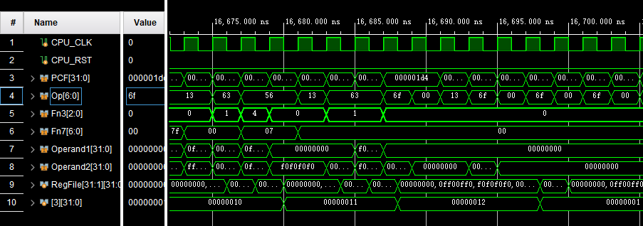
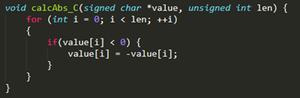
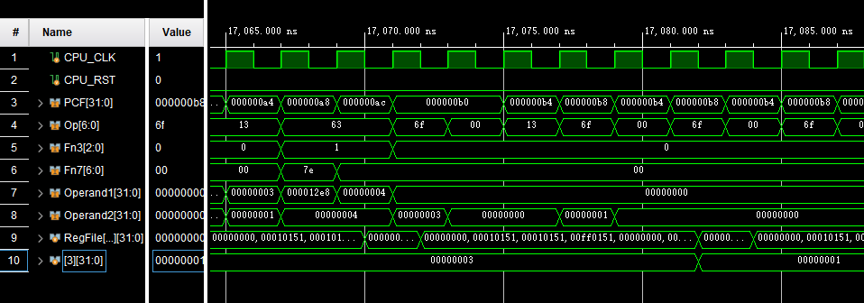

# Project 4

<p align="right">分数分配：平等分配</p>

<p align="right">3180105143 张家浚 3190105811 徐李可儿</p>

[toc]

## 实验目标

1.用verilog实现扩展SIMD模块的RV32I 流水线CPU

2.制作适当的测试代码，验证CPU是否能成功运行SIMD模块指令集

2.制作函数代码，验证CPU是否能成功执行函数功能，并比较性能

## 实验环境和工具

实验环境：Windows 10操作系统

实验工具：Vivado 2021.2软件

根据testbench.v要求，目标设备是Nexys4开发板（使用vivado part xc7a100tcsg324-1模拟）

## 实验内容和过程

### CPU模块实现：Verilog源代码补充及分析

SIMDCPU的基础板块和在Proj2中完成的板块大致相同，下仅列出不同处

#### ControlUnit模块

**设计思路**

基本与Proj2相同，对新增设的vec指令做如下改动信号

1.  根据模板中新定义的Opcode标识符替换Proj2中直接采用Fn7值的部分
2.  计算alu_vec_id信号：仅在两种Vec指令下赋1
3.  计算AluSrc2D信号：SLLI/SRLI/SRAI以及对应的三种向量指令为01，R型和B型指令为00，其他指令均为10
4.  通过在Case(Op)下并列，将原RegReg、RegImm型指令的控制信号对应的赋给vecReg和vecImm型

**代码**（仅列出与Proj2不同处）

```verilog
//assign wire

    assign AluSrc2D   = (((Op == `OP_RegImm)||(Op == `OP_vecImm))&&(Fn3[1:0] == 2'b01)) ? (2'b01) : (((Op == `OP_RegReg)||(Op == `OP_vecReg)||(Op == `OP_Branch)) ? 2'b00 : 2'b10);//00:ForwardData2 01:Rs2E 10:Imm

    assign alu_vec_id = ((Op == `OP_vecReg)||(Op ==`OP_vecImm)) ? 1'b1:1'b0;

//sequence:R-type,I-type,S-type,B-type,U-type,J-type
//output reg    output sequence:
//                    ImmType
//                    RegWriteD
//                    MemWriteD
//                    RegReadD
//                    BranchTypeD
//                    AluContrlD
    always@(*)
    begin
        case(Op)
            `OP_RegReg,
            `OP_vecReg:    //R-TYPE Reg-Reg/vec
                                begin
                    ImmType <= `RTYPE;
                    RegWriteD <= `LW;
                    MemWriteD <= 4'b0000;
                    RegReadD <= 2'b11;
                    BranchTypeD <= `NOBRANCH;
//                  AluContrlD <= CASE BELOW;
                    case(Fn3)
                        3'b000:    //ADD or SUB
                            AluContrlD <= (Fn7 == 7'b0) ? (`ADD):(`SUB);
                        3'b001:    //SLL
                            AluContrlD <= `SLL;
                        3'b010:    //SLT
                            AluContrlD <= `SLT;
                        3'b011:    //SLTU
                            AluContrlD <= `SLTU;
                        3'b100:    //XOR
                            AluContrlD <= `XOR;
                        3'b101:    //SRL or SRA
                            AluContrlD <= (Fn7 == 7'b0) ? (`SRL):(`SRA);
                        3'b110:    //OR
                            AluContrlD <= `OR;
                        3'b111:    //AND
                            AluContrlD <= `AND;
                    endcase
                end
            `OP_RegImm,
            `OP_vecImm:     //I-Type (ALU) Reg-Imm/vecImm
                begin
                    ImmType <= `ITYPE;
                    RegWriteD <= `LW;
                    MemWriteD <= 4'b0000;
                    RegReadD <= 2'b10;
                    BranchTypeD <= `NOBRANCH;
//                  AluContrlD <= CASE BELOW;
                    case(Fn3)
                        3'b000:    //ADDI
                            AluContrlD <= `ADD;
                        3'b001:    //SLLI
                            AluContrlD <= `SLL;
                        3'b010:    //SLTI
                            AluContrlD <= `SLT;
                        3'b011:    //SLTUI
                            AluContrlD <= `SLTU;
                        3'b100:    //XORI
                            AluContrlD <= `XOR;
                        3'b101:    //SRLI or SRAI
                            AluContrlD <= (Fn7 == 7'b0) ? (`SRL):(`SRA);
                        3'b110:    //ORI
                            AluContrlD <= `OR;
                        3'b111:    //ANDI
                            AluContrlD <= `AND;
                    endcase
                end
            //其他同Proj2
```

#### ALU模块

**设计思路**

根据新增设的alu_vec信号，查询Parameters下改动过的宏定义，形成AluCon信号并增加Vec运算相关定义

**代码**

```verilog
module ALU(
    input wire [31:0] Operand1,
    input wire [31:0] Operand2,
    input wire [4:0] AluContrl,
    input wire alu_vec,
    output reg [31:0] AluOut
    );
    wire [4:0] AluCon;
    assign AluCon[4:1] = AluContrl[4:1];
    assign AluCon[0] = alu_vec;

    reg [7:0] vec1 [3:0];
    reg [7:0] vec2 [3:0];
    reg [7:0] vecout [3:0];
    integer i;
    
    always@(*)
    begin
        {vec1[3], vec1[2], vec1[1], vec1[0]} = Operand1;
        {vec2[3], vec2[2], vec2[1], vec2[0]} = Operand2;
        case (AluCon)
            `SLL:        AluOut<=Operand1 << Operand2[4:0]; 
            `SRL:        AluOut<=Operand1 >> Operand2[4:0]; 
            `SRA:        AluOut<=$signed(Operand1) >>> Operand2[4:0]; 
            `ADD:        AluOut<=Operand1 + Operand2; 
            `SUB:        AluOut<=Operand1 - Operand2; 
            `XOR:        AluOut<=Operand1 ^ Operand2; 
            `OR:         AluOut<=Operand1 | Operand2; 
            `AND:        AluOut<=Operand1 & Operand2; 
            `SLT:        AluOut<=($signed(Operand1) < $signed(Operand2)) ? 32'b1:32'b0; 
            `SLTU:       AluOut<=(Operand1 < Operand2) ? 32'b1:32'b0; 
            `LUI:        AluOut<={Operand2[31:12], 12'b0}; 
            `VECSLL:     for(i=0;i<4;i=i+1) vecout[i]<=vec1[i] << vec2[i][4:0]; 
            `VECSRL:     for(i=0;i<4;i=i+1) vecout[i]<=vec1[i] >> vec2[i][4:0]; 
            `VECSRA:     for(i=0;i<4;i=i+1) vecout[i]<=$signed(vec1[i]) >>> vec2[i][4:0]; 
            `VECADD:     for(i=0;i<4;i=i+1) vecout[i]<=vec1[i] + vec2[i]; 
            `VECSUB:     for(i=0;i<4;i=i+1) vecout[i]<=vec1[i] - vec2[i]; 
            `VECXOR:     for(i=0;i<4;i=i+1) vecout[i]<=vec1[i] ^ vec2[i]; 
            `VECOR:      for(i=0;i<4;i=i+1) vecout[i]<=vec1[i] | vec2[i]; 
            `VECAND:     for(i=0;i<4;i=i+1) vecout[i]<=vec1[i] & vec2[i]; 
            `VECSLT:     for(i=0;i<4;i=i+1) vecout[i]<=($signed(vec1[i]) < $signed(vec2[i])) ? 32'b1:32'b0; 
            `VECSLTU:    for(i=0;i<4;i=i+1) vecout[i]<=(vec1[i] < vec2[i]) ? 32'b1:32'b0; 
            default:     AluOut<=32'hxxxxxxxx;
        endcase         
        if (alu_vec)
            begin
            AluOut <= {vecout[3][7:0], vecout[2][7:0], vecout[1][7:0], vecout[0][7:0]};
            end
    end
endmodule
```

#### RV32Core模块

**设计思路**

Rv32Core是CPU的底层模块，在SIMD模块的CPU中，需要增加或修改

1.  Rv32Core额外传递的alu_vec_ex信号
2.  根据需要将AluContrl信号的长度从[3:0]增长到[4:0]
3.  Operand2信号在遇到SLLI/SRLI/SRAI对应的向量指令时，需要将特别的立即数shamt加载到其他三个向量位

**代码**

```verilog
Operand2 = AluSrc2E[1]?(ImmE):( AluSrc2E[0]?(alu_vec_ex?{3'b0,Rs2E,3'b0,Rs2E,3'b0,Rs2E,3'b0,Rs2E}:Rs2E):ForwardData2 );
```

#### EXSegReg模块

**设计思路**

ExSegReg将ID段寄存器给的值传递到各模块执行，传递ImmD时，如果遇到vec型指令，需要将立即数加载到四个向量位点，在给出的模版中，这一步在CPUcore中完成，会与ExSegReg的赋值冲突导致错误，故挪到Ex段寄存器完成

**代码**

```verilog
                case (alu_vec_id)
                    1'b0:
                    ImmE<=ImmD;
                    1'b1:
                    ImmE<={ImmD[7:0],ImmD[7:0],ImmD[7:0],ImmD[7:0]};
```

其他模块均与Proj2相同

### 实验仿真结果

#### PART1

测试使用了

-   测试使用了改编自https://github.com/riscv-software-src/riscv-tests/tree/master/isa/rv32ui中的ADD、SUB、SRL、SRA、SLL、OR、XOR、AND、ADDI、SRLI、SRAI、SLLI、ORI、XORI、ANDI15个指令的测试，使用自制的批处理文件在windows环境下进行预处理并使用mingw32-make和提供的makefile和其他相关toolchain生成的测试文件
-   根据上条生成的测试文件，选择部分测试将指令部分变换为向量指令（仅对应改变opcode*）后，再修改对应跳转指令的Imm值**，形成自己的testall文件，测试全部15个指令

*在16进制显示的data和inst文件中，将要改变的指令按如下规则改变

-   将代表RegReg指令的13和93(x0010011)对应地改为vecReg指令的56和d6(x1010110)
-   将代表RegImm指令的33和b3(x0110011)对应地改为vecImm指令的57和d7(x1010111)

**采用自编的python代码计算跳转指令

```python
des = int('10180',16)
now = int('1016c',16)
dif = '{:0>12b}'.format((des - now)//2)
rs2 = '11101'
rs1 = '11110'
fn3 = '001'  
#以上五值均根据实际需要手动修改，参照提供的测试，大多以bne t5,t4,<fail>为标准跳转指令格式，大多数时候只需要修改des和now的值，故此处以此为例
res2 = str(dif[0])+str(dif[2:8]) + rs2 + rs1 + fn3 + str(dif[8:12])+str(dif[1])+ '1100011'
res16 = '{:0>8x}'.format(int(res2,2))
print(res16)
```

与proj2提供的testbench.v对接，运行测试后



gp寄存器的最终值变为1，表明测试成功进行。

进一步根据指令检查个寄存器值，结果表明对CPU的检验成功进行，所有指令都能正常执行，寄存器值均符合预期。

#### PART2

分别用不含SIMD扩展的代码和含SIMD扩展代码实现对矩阵取绝对值功能：



```assembly
#不含扩展汇编
xori    a4,zero,sqrt(len//4)
xori    a3,zero,4
sll     a3,a3,a4       #根据矩阵大小len确定起始地址和存放地址的差，由题目数据大小为8bits即1byte，一行能储存4个数据
auipc   ra,1
addi    ra,ra,xxxx     #模仿官方给出的lb测试，计算起始地址并与指令在RAM中储存地址隔开
li      a5,128         #0x00000080 常数值，方便用and操作取符号位
li      tp,0           #int i = 0
li      t0,len         #i < len
<LOOP>:
lb      t5,0(ra)       #从起始地址读取数据
and     a6,a5,t5       #取符号位
beqz    a6,+8          #if value[i]<0
neg     t5,t5          #value[i] = -value[i]
add     sp,ra,a3       #计算存入地址，紧接在起始地址之后
sb      t4,0(sp)       #存入
addi    tp,tp,1        #i++
addi    ra,ra,1        #地址前移1byte
bne     tp,t0,<LOOP>   #for循环继续
```

```assembly
#含SIMD扩展
xori    a4,zero,sqrt(len//4)
xori    a3,zero,4
sll     a3,a3,a4       #根据矩阵大小len确定起始地址和存放地址的差，由题目数据大小为8bits即1byte，一行能储存4个数据
auipc   ra,1
addi    ra,ra,xxxx     #模仿官方给出的lw测试，计算起始地址并与指令在RAM中储存地址隔开
vli     a5,128         #0x80808080 常数值，方便用and操作取符号位
li      tp,0           #int i = 0
li      t0,len//4      #4*i < len
<LOOP>:
lw      t5,0(ra)       #以向量形式从起始地址同时读取4个数据
vand    a6,a5,t5       #取符号位
vsrai   a6,a6,7        #将符号位扩展，方便对特定数据取反
vneg    t3,t5          #negvalue[i:i+3] = -value[i:i+3]
vand    a6,a6,t3       #temp = value[i]<0 ? negvalue[i] : 0 #通过在刚才扩展到ff的符号位and操作实现
vadd    t5,t5,a6       #value[i:i+3] = value[i:i+3] + 2temp
vadd    t5,t5,a6
add     sp,ra,a3       #计算存入地址，紧接在起始地址之后
sw      t4,0(sp)       #存入
addi    tp,tp,1        #i++
addi    ra,ra,4        #地址前移1word
bne     tp,t0,<LOOP>   #for循环继续
```

在实际测试中，填入len和起始地址，并将存入操作替换为读取正确的绝对值结果并比较，结果如下



将两种方法以第一条xori时间作为开始时间，以for循环结束(bne指令最后一次结束)作为结束时间，比较运行时

|          | 运行时(len=4) | 运行时(len=16) |
| -------- | ------------- | -------------- |
| 非扩展   | 250ns         | 486ns          |
| SIMD扩展 | 82ns          | 152ns          |

明显SIMD扩展比非扩展有显著的运行时优势

## 实验总结

3180105143 张家浚

踩过的坑：

-   RV32Core模块中对ImmE赋值与EXSegReg冲突的bug排除耗时较久
-   手写代码对跳转地址的判断和对应指令码书写耗时较久

收获：对时序控制和verilog编写有更深入的认识。

用时：

-   4小时补全需要补的模块（包含debug过程）（共同）
-   6小时编写测试文件，（包含将函数汇编代码调整为测试汇编代码）调整testbench.v并运行所有测试


3190105811 徐李可儿

踩过的坑：

-   尝试用Proj2提供的Util工具包生成汇编代码，结果发现工具包貌似不含v扩展

收获：对RiscV指令集和SIMD有了更深入的理解。

用时：

-   5小时Verilog模块补全（包含debug过程）（共同）
-   2小时根据绝对值函数描述写RiscV汇编代码
-   1小时完成文档撰写

## 提出改进实验的意见

-   所提供的CPU模板包含一些bug，希望去掉（特别是ImmE的赋值冲突）
-   虽然不指望直接生成testfile，希望提供一个单条机器指令计算器能够根据输入的汇编指令生成16进制机器码，这能大幅减轻工作量


